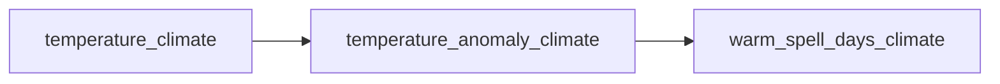

# The DAG model

At its core, conduit represents a pipeline as a **Directed Acyclic Graph (DAG)**. This
page explains what that means and why it is the right abstraction.

## What is a DAG?

A Directed Acyclic Graph is a network of nodes connected by directed edges, with no
cycles. In conduit:

- **Nodes** are computations — functions that produce a value (typically an
  `xarray.DataArray`).
- **Edges** are dependencies — if node B needs the output of node A, there is a directed
  edge from A to B.
- **Acyclic** means no circular dependencies; computation always flows forward.

Here `temperature_anomaly_climate` is derived from `temperature_climate`, and
`warm_spell_days_climate` from the anomaly. The DAG makes these dependencies explicit
and machine-readable — which is what lets conduit reason about the whole pipeline.

## Why a DAG?

- **Automatic dependency resolution.** You declare *what* you want (the output
  variables), not *how* to compute it. The engine works out which nodes to run, and in
  what order.
- **Lazy execution.** Only the nodes needed for your requested outputs run. Ask for one
  variable and unrelated branches never execute.
- **Reproducibility.** Every output is a pure function of its inputs, so the same config
  and data always produce the same result.
- **Composability.** Nodes declare their inputs and outputs by name, so you extend a
  pipeline by adding one config section — inline with `[[node]]` or by pointing at your
  own module with `_import_path`.

## Config *is* the DAG

conduit's distinctive choice is that the graph is described in a plain-text
[TOML](https://toml.io) config, not assembled imperatively in a script. The config
names inputs, nodes and outputs; conduit inspects each function's signature (parameter
names = required inputs, return = produced output) and connects everything into one
graph.

Two consequences follow, and they are the heart of conduit's value:

- Because the whole graph exists *before* execution, conduit can **check the entire
  pipeline before it runs** — contracts and wiring both (see
  [Contracts before compute](contracts.md)).
- Because the graph is separate from the functions, **how** the graph executes
  (in-memory, out-of-core, blocked, parallel) is a config decision, not a rewrite (see
  [Scaling model](scaling.md)).

The config also doubles as a complete provenance record: `conduit run` stamps it into
every output.

## How the pieces fit

conduit builds on [Apache Hamilton](https://github.com/DAGWorks-Inc/hamilton) as the DAG
engine. A run proceeds in four stages:

1. **Parse** — read the TOML into a validated `ParsedConfig`.
2. **Build** — import the modules (`node` built-in plus any `_import_path` modules),
   inspect signatures, connect input loaders, nodes and output savers into one graph,
   and run the build-time contract check.
3. **Execute** — trace back from the requested outputs, run the required nodes in
   topological order (optionally cached/blocked), and save results.
4. **Visualise** (any time) — `conduit graph config.toml --pdf` renders the graph.

## Node naming

Every node has a unique name. Input nodes combine the file variable with the section
suffix (`{var}{suffix}`), so `temperature` under `[inputs.climate]` becomes
`temperature_climate`. The suffix is a *convention* — `_<label>` by default, `""`
(bare names) or whatever you set via `suffix` — see
[Configuration › inputs](../reference/configuration.md#inputs). An explicit `vars`
mapping lets you decouple file names from node names entirely.

## See also

- [Why conduit?](why-conduit.md) — the design philosophy behind these choices.
- [Bring your own module](../guides/bring-your-own-module.md) — how functions become
  nodes.
