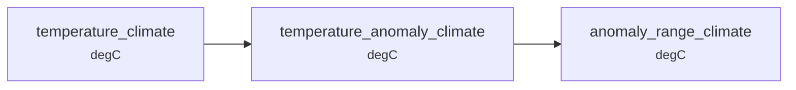

# Overview

conduit is built around one choice: keep the graph separate from the functions, and let the functions carry their own contracts.

A node is a plain xarray function.
It names its inputs by parameter name and its output by return type, and says nothing about where its data comes from, what else consumes it, or how it will be executed.
The wiring lives in a TOML file instead.

Everything else follows from that split.
The functions can be written and tested without a pipeline, the pipeline can be assembled and checked without running, and how it runs is a separate decision again.
Working with conduit therefore falls into four stages.

## 1. Write the science code

Ordinary Python functions that take and return `xarray.DataArray`s, in an ordinary importable module.
Hamilton derives the edges from parameter names, so a function that consumes `temperature_daily` is wired to whatever produces it.
[Annotations](https://docs.python.org/3/library/typing.html#typing.Annotated) on the signature declare what the function requires and what it produces.

Read [The pipeline model](pipeline-model.md) for why the wiring is derived rather than written.
Then [Bring your own module](../guides/nodes/bring-your-own-module.md) and [Declaring contracts](../guides/nodes/contracts.md).

## 2. Write the config

A TOML file names the input files, the nodes, and the outputs you want.
This is the stage most people spend most of their time in, and it needs no Python: adapting someone else's config means changing paths, adding a variable, or asking for a different output.

Start at [Write a config](../guides/configs/write-a-config.md), and reach for [Inline nodes and fan-out](../guides/configs/inline-nodes-and-fan-out.md) when a derivation is too small to deserve a module.

## 3. Validate

The config names every node and every function declares its own signature, so conduit can assemble the complete graph without computing a single array.
Every edge then carries a claim that can be checked against the claim at the other end.
`conduit run --dry-run` does the whole pre-flight: the config parses, the inputs open, the DAG builds, the contracts agree, the outputs are reachable and their destinations writable.

[Contracts and the whole-graph check](contracts.md) explains what that buys and what it misses.
The guides are [Visualise the graph](../guides/validate/visualise-the-graph.md), [Validate before running](../guides/validate/validate-before-running.md) and [Test your pipeline](../guides/validate/test-your-pipeline.md).

## 4. Run

A node operates on xarray objects, and those are backed by NumPy or dask interchangeably.
Nothing in the function knows which, how much of the data is in flight at once, or how many processes are involved.
So the execution strategy is a config decision, and the same pipeline runs on a laptop and across a cluster.

[Execution and scaling](execution.md) is the decision matrix.
The knobs are in [Run from the CLI](../guides/run/run-from-the-cli.md), [Drive conduit from Python](../guides/run/drive-from-python.md) and [Scale up a pipeline](../guides/run/scale-up.md).

## Where next

[Pipeline 101](../recipes/pipeline-101.md) is all four stages in miniature, running end to end.
