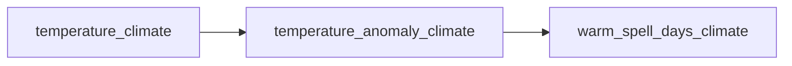

# How conduit works: Directed Acyclic Graphs

At its core, conduit represents a pipeline as a **Directed Acyclic Graph (DAG)**.
This section explains what that means and why it matters.

## What is a DAG?

A Directed Acyclic Graph is a network of nodes connected by directed edges, with no cycles.
In conduit:

- **Nodes** are computations — Python functions that produce a value (typically an `xarray.DataArray`).
- **Edges** represent dependencies — if node B needs the output of node A, there is a directed edge from A to B.
- **Acyclic** means there are no circular dependencies; computation always flows forward.



In this simplified example, `temperature_anomaly_climate` is derived from
`temperature_climate`, and `warm_spell_days_climate` from the anomaly. The DAG makes
these dependencies explicit and machine-readable.

## Why DAGs?

### Automatic dependency resolution

You declare **what** you want (the output variables), not **how** to compute them.
The DAG engine figures out which nodes need to run and in what order.

### Lazy execution

Only the nodes required to produce your requested outputs are executed. If you only ask
for the anomaly, any unrelated nodes never run.

### Reproducibility

Every output is a pure function of its inputs. The same config and data always produce
the same results.

### Composability

Nodes are independent and declare their inputs and outputs by name. You can add a new
computation to an existing pipeline by adding one config section — inline with `[[node]]`
or by pointing at your own module with `_import_path`.

## How conduit uses DAGs

conduit is built on the [Apache Hamilton](https://github.com/DAGWorks-Inc/hamilton)
DAG framework. Here's how the pieces fit together:

### 1. Configuration

You write a TOML config that declares which modules to run, where to load data from, and
what to save:

```toml
[inputs.climate]
path = "data/climate.nc"
vars = ["temperature"]

[[node]]
name = "temperature_anomaly_climate"
inputs = ["temperature_climate"]
expression = "temperature_climate - temperature_climate.mean('time')"
units = "degC"

[outputs.climate]
path = "results/anomaly.nc"
vars = ["temperature_anomaly"]
```

### 2. Build

When you run `conduit run config.toml`, conduit:

1. Parses the config file.
2. Imports the requested modules — the built-ins (`node`, `resample`) and any of your own
   modules referenced by `_import_path`.
3. Builds a DAG by inspecting each function's signature (parameter names = required
   inputs, return values = produced outputs).
4. Connects input loaders, your nodes, resampling steps, and output savers into a single
   graph, and runs the build-time unit-consistency check.

### 3. Execute

The DAG engine:

1. Starts from your requested target nodes.
2. Traces backwards to find all required upstream nodes.
3. Executes nodes in topological order, optionally caching results.
4. Returns or saves the final outputs.

### 4. Visualise

You can inspect the DAG at any time:

```bash
conduit graph config.toml --pdf
```

This produces a visual graph showing all nodes and their dependencies.

## Nodes and naming

Every node in the DAG has a unique name. Inputs become node names by combining the
variable with the section's suffix (`{var}{suffix}`), so `temperature` under
`[inputs.climate]` becomes `temperature_climate`.

The suffix is a **convention, not a requirement**: by default it is `_<section>`, except
the conventional `static` section which uses bare names. Set `suffix = ""` for bare names
on any section, or `suffix = "_x"` to choose your own. When sections represent temporal
frequencies (e.g. `daily`/`weekly`/`monthly`), the optional [resampling](../usage/config.md)
step creates edges between them (e.g. aggregating daily to weekly).

## Custom modules

You can add your own functions to the DAG. Any Python module that follows Hamilton
conventions (functions whose parameter names match node names) can be included via
`_import_path`. See [Custom modules](../usage/custom-modules.md) for details.
