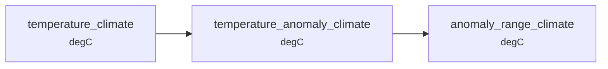

# How it works

conduit is built around one choice: keep the graph separate from the functions, and let the functions carry their own contracts.

A node is a plain xarray function.
It names its inputs by parameter name and its output by return type, and says nothing about where its data comes from, what else consumes it, or how it will be executed.
The wiring lives in a TOML file instead.

Two useful things come out of that.

## The whole graph exists before anything runs

The config names every node and every function declares its own signature, so conduit can assemble the complete graph without computing a single array.
Each function's annotations say what it expects and what it produces, so every edge in that graph carries a claim that can be checked against the claim at the other end.

[xarray-annotated](https://github.com/jmarshrossney/xarray-annotated) already checks one function's annotations against its own arguments.
Checking every edge before the graph runs needs the annotations *and* the graph together, and that is the bit conduit adds.

The check covers units, dimensions, coordinates, dtype and temporal frequency, plus the wiring itself.
An input nothing produces is an error; an input nothing consumes is a warning.
See [Declaring contracts](guides/authoring/contracts.md) for the vocabulary and [Validate before running](guides/running/validate-before-running.md) for the pre-flight that uses it.

### What it cannot catch

The check shows the pipeline is *consistent*.
It says nothing about whether it is *correct*.

A contract is a claim about the shape and units of data on an edge, so anything that leaves those unchanged passes.
Summing a rate where you meant to average it gives the same units and the same dimensions, and no check will save you.
[Resampling and units](guides/authoring/resampling-and-units.md) is about that specific trap.
A sign error, a wrong coefficient, or the right calculation on the wrong variable are all invisible here too.

Contracts narrow the space of mistakes. They do not empty it.

## Execution is a separate decision

A node operates on xarray objects, and those are backed by NumPy or dask arrays interchangeably.
Nothing in the function knows which, how much of the data is in flight at once, or how many processes are involved.
So all of that becomes a config decision:

- Hand a node dask-backed inputs and it streams lazily and out-of-core, unchanged.
- conduit holds the whole graph as a value, so it can slice the inputs, drive the graph over one partition, and recombine.
- A run is a pure function of its config and inputs, so running disjoint spatial shards in separate processes is safe. There is no shared mutable state to contend over.

In a hand-written script the loop bounds, chunk sizes and parallelism end up tangled into the science.
Pulling them apart is what makes scale a configuration concern.
The practical knobs are in [Scale up a pipeline](guides/scaling/scale-up.md).

None of those knobs changes the result or the contracts: same graph, same checks, same outputs, different execution strategy.
That is what lets you develop against a tiny in-memory run and then deploy the identical pipeline across a cluster.

## What a run does

1. **Parse.** Read the TOML into a validated `ParsedConfig`.
2. **Build.** Import the modules — the `[[node]]` built-in plus anything named by `_import_path` — inspect their signatures, connect input loaders, nodes and output savers into one graph, and run the build-time contract check.
3. **Execute.** Trace back from the requested outputs, run the required nodes in topological order, optionally cached or blocked, and save the results.
4. **Visualise.** At any point, `conduit graph config.toml --pdf` renders the graph without running it.

Only the nodes your requested outputs depend on ever execute.
Ask for one variable and unrelated branches never run.

`conduit run` also stamps the config text and its SHA-256 into every output, so a result file records the pipeline that produced it.

## Design principles

**DAG-first.**
The graph is the main abstraction.
You declare what to compute and the engine works out how.

**Config-driven.**
A pipeline is described in TOML.
You can run and compose one without writing Python, and the config is easy to version, diff and review.

**Module independence.**
A node knows its own inputs and output and nothing about its neighbours, so you can add a computation without touching existing code, and test each module on its own.
Your modules follow the same conventions as the built-ins.

**Expose, don't wrap.**
The Hamilton driver and the raw xarray objects stay reachable when you want them.
The aim is that you never *have* to learn Hamilton or pint.

**Domain-agnostic core.**
Nothing domain-specific is built in.
Forward models, land-cover classification and analysis pipelines are all expressed the same way.
Gridded geospatial Zarr is the main target, but it lives in an optional layer (`conduit[geo]`), so importing conduit never pulls in geospatial dependencies.

## Where next

- [Bring your own module](guides/authoring/bring-your-own-module.md) — the conventions a node function must follow.
- [Declaring contracts](guides/authoring/contracts.md) — units, dims, coords, dtype and frequency.
- [Pipeline 101](recipes/pipeline-101.md) — all of the above, running.
